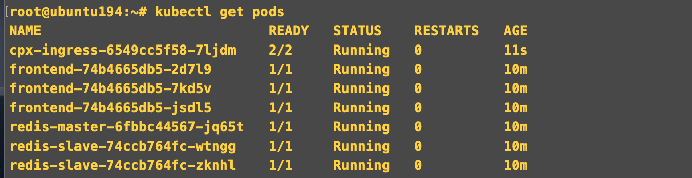

# **Citrix CPX and Ingress Controller** 

Citrix CPX is a container based ADC which can be used for load balancing or exposes routes from outside the k8s cluster to services within the k8s cluster. Citrix Ingress controller is a micro service which runs on a Kubernetes cluster and pick up the ingress and configure the appropriates routes on Citrix CPX. Citrix ADC has many form factor which include SDX, MPX, VPX, CPX and BLX. This section talks about how to use Citrix CPX, Citrix ingress controller and expose application routes to CPX via Citrix Ingress controller. Citrix has CPX with builtin ingress controller we are using that form factor here.

## **Who should read this?**

1. If you want to setup a micro service on a Kubernetes and want to create route using citrix ingress controller.
2. If you want to validate Citrix ingress controller and Citrix ADC (CPX).
3. If you want to understand Kubernetes ingress concepts.
 
## **This Section contains**

1. Deploy an application on Kubernetes cluster  
2. Citrix ADC as Ingress Device 
3. Access the  application.
4. Why Citrix ADC is better choice for loadbalancing?

## **Deploy guestbook application**

First we can deploy the application on a kubernetes cluster.

```
    kubectl apply -f https://raw.githubusercontent.com/Chorusio/NetworkSolutionArchitect/master/controller/apps/guestbook-all-in-one.yaml
```

## **Deploy CPX**

Deploy the CPX with builtin ingress controller as a pod in the cluster.

```    
    kubectl apply -f https://raw.githubusercontent.com/Chorusio/NetworkSolutionArchitect/master/controller/citrix/citrix-k8s-cpx-ingress.yml
```

## **Verify the states of APPS and CPX**

Check the states of CPX and guest book application which we have deployed using 
```
 kubectl get pods
```
will get the output like following.



## **Expose guestbook application using ingress resource**

Now your guestbook application and CPX is up and running. Next step is to expose this application for users. 
Citrix ADC is being used here to route the traffic to the guestbook service. Citrix CPX is running as POD in Kubernetes cluster. 

1. Deploy the ingress resource for guestbook application.
   
   ```
      kubectl apply -f  https://raw.githubusercontent.com/Chorusio/NetworkSolutionArchitect/master/controller/apps/guestbook-ingress.yaml
   ```

2. Verify configurations has been created on Citrix ADC.
   
   
   1. Check CS vserver configuration.

      

   2. Check LB and Servicegroup configuration.

      

  
## **Access the application** 

Access the application using the csvserver IP used in the ADC configuration. We can use curl, FileZilla or any such tools.
   


Once  its connected, we can transfer files between local host and server.
   

## **Why Citrix ADC is better choice for exposing the SFTP service.**

1. Citrix ADC allows you to monitor your service at deep level by checking whether the file present in the service or not. This can be easily set using smart annotation provided [here](https://github.com/citrix/citrix-k8s-ingress-controller/blob/master/docs/configure/annotations.md).
2. Citrix ADC allows to distribute the traffic to right pod in the right Node which reduces the latency compared to other ADC.
3. Citrix ADC allows to reach to the service IP (pod) irrespective of which subnet your cluster and Citrix ADC runs. refer [here](https://github.com/citrix/citrix-k8s-node-controller)  


  
